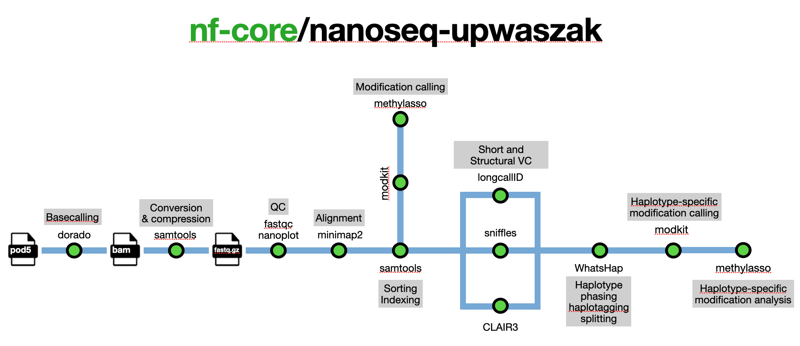

## EPFL-nanoseq Pipeline



Custom [nf-core/nanoseq](https://nf-co.re/nanoseq) pipeline for Oxford Nanopore long-read sequencing, adapted for the UPWASZAK lab at EPFL: https://www.epfl.ch/labs/upwaszak

---

## 🔧 How to Run the Pipeline

We provide four wrapper scripts for common use cases:

### 1. `run_pipeline.sh`
- Runs basecalling locally on a GPU-enabled machine (BMO)
- Transfers data and the pipeline to a remote server (TREX) via `rsync`
- SSHes into TREX, starts a `tmux` session, and runs the remaining steps (alignment, variant calling, annotation, etc.)

### 2. `run_pipeline_local.sh`
- Runs the full pipeline locally (basecalling + variant calling)

### 3. `run_pipeline_only_basecalling.sh`
- Runs only the basecalling step locally

### 4. `run_pipeline_skip_basecalling.sh`
- Skips basecalling and runs all other steps locally (expects existing `.fastq.gz` input)

Each script has a configuration section you can customize. You must provide a valid input file (`.pod5` or `.fastq.gz`), and tune parameters accordingly.

Example configuration section:

```bash
### === CONFIGURATION (edit these only) ===
REMOTE_HOST="upwaszaksrv1.epfl.ch"                
REMOTE_USER="${USER}"
SAMPLE_NAME="sampleName"  
REMOTE_DEST_DIR="${SAMPLE_NAME}"                   

INPUT_PATH="small_NA12878_DNA.pod5"  # .pod5 or .fastq.gz
GTF_PATH=""                                     
DORADO_MODEL="hac"                                 
DORADO_MODIFICATION="5mCG_5hmCG"
CALL_VARIANTS=true
VARIANT_CALLER="clair3"
CLAIR_MODEL="dorado_model"                         
STRUCTURAL_VARIANT_CALLER="longcalld"
PHASE_WHATSHAP=true
ANNOTATE_VCF=true
### =======================================
```

---

## 🛠 How to Modify the Pipeline

### Change Parameters
- Most parameters can be modified directly in the wrapper scripts (e.g., model type, input paths, tool settings).
- For more advanced configuration (e.g., `max.cpus`, `max.memory`, `max.time`, and default resources), check and edit the `nextflow.config` file.

### Modify Pipeline Logic
- Main workflow: `workflows/nanoseq.nf`
- Organized into:
  - `subworkflows/`: groups of related steps
  - `modules/`: individual tool processes

To change behavior of a specific tool (e.g. Clair3):
1. Locate where it's called in `nanoseq.nf`
2. Follow to `subworkflows/local/short_variant_calling.nf`
3. Modify logic in `modules/local/clair3.nf`

---

## 🧪 Custom Docker Containers

Each module in the pipeline runs inside a container that includes all the necessary tools for that specific process (e.g., Clair3, LongCalld, etc.).

If you need a custom setup (e.g., additional tools, modified versions), you can assign a custom container directly inside the module by specifying:

```groovy
container 'docker.io/ff1997/methylasso:latest'
```

### 🔨 Build & Push a Custom Container

To create your own container and push on Docker Hub:

1. Write a `Dockerfile` with the required tools.
2. Build and push it to Docker Hub:

```bash
docker buildx build --platform linux/amd64 -t ff1997/methylasso:latest --load .
docker push ff1997/methylasso:latest
```

All Dockerfiles used in this pipeline are stored under the `/containers/` directory.

---

## 👤 Credits

Francesco Feher  
📧 francesco.feher@gmail.com
